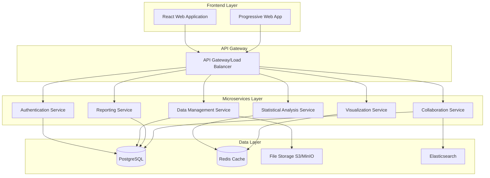
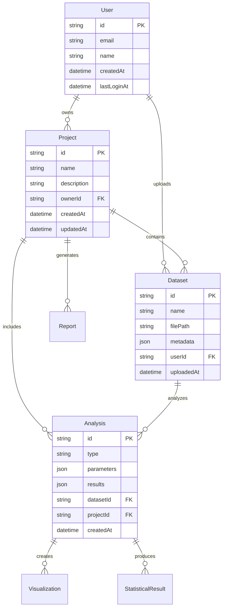

# Design Document

## Overview

The DataTab clone will be a modern, web-based statistical analysis platform built using a microservices architecture with React frontend and Node.js backend services. The platform will provide an intuitive interface for data import, preprocessing, statistical analysis, visualization, and collaborative reporting. The system will be designed for scalability, maintainability, and extensibility to support various statistical methods and data formats.

## Architecture

### High-Level Architecture

The system follows a layered microservices architecture:



### Technology Stack

**Frontend:**
- React 18 with TypeScript
- Material-UI for component library
- Chart.js/D3.js for visualizations
- React Query for state management
- Vite for build tooling

**Backend:**
- Node.js with Express.js
- TypeScript for type safety
- Simple-statistics library for statistical computations
- Multer for file uploads
- Socket.io for real-time collaboration

**Database & Storage:**
- PostgreSQL for structured data
- Redis for caching and session management
- MinIO/S3 for file storage
- Elasticsearch for search functionality

**Infrastructure:**
- Docker containers
- Kubernetes for orchestration
- NGINX for reverse proxy
- JWT for authentication

## Components and Interfaces

### 1. Data Management Service

**Responsibilities:**
- File upload and parsing (CSV, Excel, JSON)
- Data validation and type inference
- Data preprocessing operations
- Dataset version management

**Key Interfaces:**
```typescript
interface DatasetMetadata {
  id: string;
  name: string;
  columns: ColumnInfo[];
  rowCount: number;
  fileSize: number;
  uploadedAt: Date;
  userId: string;
}

interface ColumnInfo {
  name: string;
  dataType: 'numeric' | 'categorical' | 'date' | 'text';
  missingValues: number;
  uniqueValues: number;
  statistics?: DescriptiveStats;
}

interface DataPreprocessingRequest {
  datasetId: string;
  operations: PreprocessingOperation[];
}
```

### 2. Statistical Analysis Service

**Responsibilities:**
- Descriptive statistics computation
- Hypothesis testing (t-tests, ANOVA, chi-square)
- Correlation and regression analysis
- Non-parametric tests
- Statistical validation and assumption checking

**Key Interfaces:**
```typescript
interface StatisticalTest {
  testType: 'ttest' | 'anova' | 'correlation' | 'regression' | 'chisquare';
  parameters: TestParameters;
  assumptions: AssumptionCheck[];
}

interface TestResult {
  testStatistic: number;
  pValue: number;
  confidenceInterval?: [number, number];
  effectSize?: number;
  interpretation: string;
  assumptions: AssumptionResult[];
}

interface DescriptiveStats {
  mean: number;
  median: number;
  mode: number[];
  standardDeviation: number;
  variance: number;
  min: number;
  max: number;
  quartiles: [number, number, number];
}
```

### 3. Visualization Service

**Responsibilities:**
- Chart generation and customization
- Interactive dashboard creation
- Export functionality (PNG, SVG, PDF)
- Real-time chart updates

**Key Interfaces:**
```typescript
interface ChartConfiguration {
  type: 'bar' | 'line' | 'scatter' | 'histogram' | 'boxplot';
  data: ChartData;
  styling: ChartStyling;
  interactivity: InteractivityOptions;
}

interface Dashboard {
  id: string;
  name: string;
  charts: ChartConfiguration[];
  layout: LayoutConfiguration;
  filters: FilterConfiguration[];
}
```

### 4. Collaboration Service

**Responsibilities:**
- Project sharing and permissions
- Real-time collaborative editing
- Comment and discussion threads
- Activity tracking and notifications

**Key Interfaces:**
```typescript
interface Project {
  id: string;
  name: string;
  description: string;
  datasets: string[];
  analyses: string[];
  collaborators: Collaborator[];
  permissions: ProjectPermissions;
}

interface Collaborator {
  userId: string;
  role: 'viewer' | 'editor' | 'admin';
  joinedAt: Date;
}
```

### 5. Reporting Service

**Responsibilities:**
- Automated report generation
- Custom report templates
- Export to multiple formats (PDF, Word, HTML)
- APA style formatting

**Key Interfaces:**
```typescript
interface Report {
  id: string;
  title: string;
  sections: ReportSection[];
  template: ReportTemplate;
  exportFormats: ExportFormat[];
}

interface ReportSection {
  type: 'text' | 'analysis' | 'visualization' | 'table';
  content: any;
  formatting: SectionFormatting;
}
```

## Data Models

### Core Entities



### Database Schema

**Users Table:**
```sql
CREATE TABLE users (
    id UUID PRIMARY KEY DEFAULT gen_random_uuid(),
    email VARCHAR(255) UNIQUE NOT NULL,
    name VARCHAR(255) NOT NULL,
    password_hash VARCHAR(255) NOT NULL,
    created_at TIMESTAMP DEFAULT CURRENT_TIMESTAMP,
    last_login_at TIMESTAMP
);
```

**Projects Table:**
```sql
CREATE TABLE projects (
    id UUID PRIMARY KEY DEFAULT gen_random_uuid(),
    name VARCHAR(255) NOT NULL,
    description TEXT,
    owner_id UUID REFERENCES users(id),
    created_at TIMESTAMP DEFAULT CURRENT_TIMESTAMP,
    updated_at TIMESTAMP DEFAULT CURRENT_TIMESTAMP
);
```

**Datasets Table:**
```sql
CREATE TABLE datasets (
    id UUID PRIMARY KEY DEFAULT gen_random_uuid(),
    name VARCHAR(255) NOT NULL,
    file_path VARCHAR(500) NOT NULL,
    metadata JSONB NOT NULL,
    user_id UUID REFERENCES users(id),
    project_id UUID REFERENCES projects(id),
    uploaded_at TIMESTAMP DEFAULT CURRENT_TIMESTAMP
);
```

## Error Handling

### Error Classification

1. **Client Errors (4xx):**
   - 400: Invalid data format or parameters
   - 401: Authentication required
   - 403: Insufficient permissions
   - 404: Resource not found
   - 413: File too large

2. **Server Errors (5xx):**
   - 500: Internal server error
   - 502: Service unavailable
   - 503: Database connection error

### Error Response Format

```typescript
interface ErrorResponse {
  error: {
    code: string;
    message: string;
    details?: any;
    timestamp: string;
    requestId: string;
  };
}
```

### Statistical Analysis Error Handling

- **Insufficient Data:** Clear messages about minimum sample sizes
- **Assumption Violations:** Suggestions for alternative tests
- **Computational Errors:** Graceful fallbacks and user guidance
- **Data Type Mismatches:** Automatic type conversion suggestions

## Testing Strategy

### Unit Testing
- **Frontend:** Jest + React Testing Library
- **Backend:** Jest + Supertest
- **Statistical Functions:** Comprehensive test suites with known datasets

### Integration Testing
- API endpoint testing
- Database integration tests
- File upload/processing workflows
- Statistical computation pipelines

### End-to-End Testing
- **Playwright** for complete user workflows
- Data import to analysis to report generation
- Collaborative features testing
- Cross-browser compatibility

### Performance Testing
- Load testing with large datasets (>1M rows)
- Concurrent user testing
- Statistical computation benchmarks
- Memory usage optimization

### Statistical Validation Testing
- Comparison with established statistical software (R, SPSS)
- Known dataset validation
- Edge case handling (missing data, outliers)
- Numerical precision testing

## Security Considerations

### Authentication & Authorization
- JWT-based authentication
- Role-based access control (RBAC)
- Multi-factor authentication support
- Session management with Redis

### Data Protection
- Encryption at rest and in transit
- GDPR compliance for EU users
- Data anonymization options
- Secure file upload validation

### API Security
- Rate limiting
- Input validation and sanitization
- SQL injection prevention
- CORS configuration

## Performance Optimization

### Frontend Optimization
- Code splitting and lazy loading
- Virtual scrolling for large datasets
- Memoization of expensive computations
- Progressive Web App features

### Backend Optimization
- Database query optimization
- Redis caching for frequent operations
- Asynchronous processing for heavy computations
- Connection pooling

### Statistical Computation Optimization
- Worker threads for CPU-intensive operations
- Streaming processing for large datasets
- Result caching for repeated analyses
- Parallel processing where applicable

## Scalability Design

### Horizontal Scaling
- Stateless microservices
- Load balancing across service instances
- Database read replicas
- CDN for static assets

### Vertical Scaling
- Memory optimization for large datasets
- CPU optimization for statistical computations
- Storage optimization for file handling

### Monitoring & Observability
- Application performance monitoring (APM)
- Statistical computation metrics
- User behavior analytics
- Error tracking and alerting